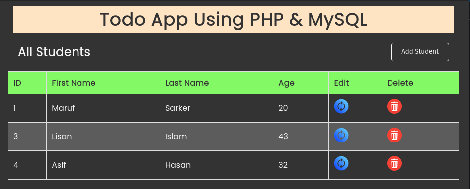

# To-Do Application

A simple web-based **To-Do Application** built using **PHP**, **MySQL**, **HTML**, **CSS**, and **JavaScript**. This project allows users to manage their tasks efficiently by adding, updating, and deleting to-do items.

## Features

- Add new to-do items with task details.
- Update existing to-do items using a modal form.
- Delete to-do items from the database.
- Display success or error messages after operations.
- Input validation for required fields.
- Modal implementation for the update functionality.

## Table of Contents

- [To-Do Application](#to-do-application)
  - [Features](#features)
  - [Table of Contents](#table-of-contents)
  - [Installation](#installation)
    - [Prerequisites](#prerequisites)
    - [Steps](#steps)
  - [Technologies Used](#technologies-used)
  - [License](#license)

## Installation

### Prerequisites
Ensure you have the following installed on your system:
- [XAMPP](https://www.apachefriends.org/index.html) (or any PHP & MySQL environment)
- [VSCode](https://code.visualstudio.com/) (or any code editor)

### Steps

1. **Clone the repository:**
   ```bash
   git clone https://github.com/your-username/todo-app-using-php-mysql.git
    ```

2. **Start Apache and MySQL servers using XAMPP.**
3. **Import the database:**
   - Open `phpmyadmin` in your browser.
   - Create a new database named `todo_app`.
   - Import the `todo_app.sql` file located in the `database` folder.
4. **Move the project files:**
5. **Open the project in your browser:**
   - Open your browser and go to `http://localhost/todo-app-using-php-mysql/`.

## Usage

1. **Add a new to-do item:**
   - Click on the `Add Task` button.
   - Enter the task title and description.
   - Click the `Add Task` button to save the task.
   - A success message will be displayed if the task is added successfully.
   - An error message will be displayed if the task is not added.
   - Click the `X` button to close the modal.

2. **Update a to-do item:**
    - Click on the `Edit` button of the task you want to update.
    - Update the task title and description.
    - Click the `Update Task` button to save the changes.
    - A success message will be displayed if the task is updated successfully.
    - An error message will be displayed if the task is not updated.
    - Click the `X` button to close the modal.

3. **Delete a to-do item:** 
    - Click on the `Delete` button of the task you want to delete.
    - Click the `Yes` button to confirm the deletion.
    - A success message will be displayed if the task is deleted successfully.
    - An error message will be displayed if the task is not deleted.

## File Structure

The project files are organized as follows:

```bash
📦todo-app-using-php-mysql
 ┣ 📂images
 ┃ ┣ 📜delete.png
 ┃ ┣ 📜project.png
 ┃ ┗ 📜update.png
 ┣ 📂utilities
 ┃ ┣ 📜dbcon.php
 ┃ ┣ 📜footer.php
 ┃ ┣ 📜header.php
 ┃ ┗ 📜script.js
 ┣ 📜README.md
 ┣ 📜deleteStudent.php
 ┣ 📜index.php
 ┣ 📜insertStudent.php
 ┣ 📜style.css
 ┗ 📜updateStudent.php
```

## Technologies Used

- **Frontend:** HTML, CSS, JavaScript
- **Backend:** PHP
- **Database:** MySQL
- **Database Management:** phpMyAdmin
- **Development Environment:** XAMPP
- **Code Editor:** Visual Studio Code



## License

This project is licensed under the MIT License - see the [LICENSE](./LICENSE) file for details.
